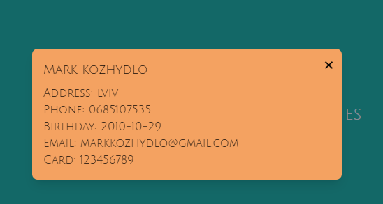

# Friends Management App - Frontend

## Overview

This is a frontend application for managing friends' contacts. Users can add, view, and search for friends easily. The application features a responsive design and a user-friendly interface, making it simple to navigate and use.

## Technologies Used

- **React**: A JavaScript library for building user interfaces.
- **Axios**: A promise-based HTTP client for making requests to the backend API.
- **Tailwind CSS**: A utility-first CSS framework for styling.
- **React Router**: A library for routing in React applications.
- **Context API**: For state management throughout the app.
- **Material-UI**: A popular React UI framework for responsive design.

## Author

- **Name**: [Kozhydlo Mark]
- **Email**: [kozhydloma@gmail.com]

## Features

- **Add New Friends**: Easily add friends to your contact list.
- **Search Functionality**: Quickly search for friends using their names.
- **Responsive Design**: Works on all screen sizes.

## Contributing

Contributions are welcome! If you have suggestions or improvements, feel free to open an issue or submit a pull request.

## License

This project is licensed under the MIT License. See the [LICENSE](LICENSE) file for more details.

